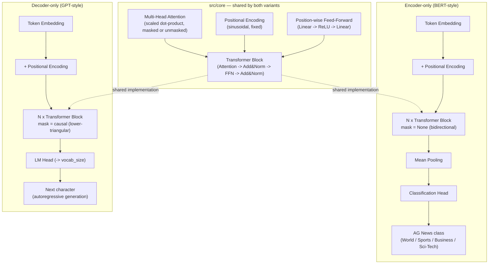

# pytorch-transformer-from-scratch

Transformer architecture ("Attention Is All You Need", Vaswani et al., 2017) implemented from scratch in raw PyTorch — no `nn.Transformer`, no HuggingFace `transformers`, no pretrained weights. Every component (multi-head attention, positional encoding, feed-forward layers, layer norm, causal masking) is implemented and unit-tested from first principles.

Two variants share one core implementation:
- **Encoder-only** (BERT-style, bidirectional) → text classification on AG News
- **Decoder-only** (GPT-style, causal) → character-level text generation on Tiny Shakespeare

## Why this project

Most of my other projects use PyTorch through high-level wrappers (HuggingFace `Trainer`, PEFT). This project demonstrates the ability to implement deep learning architectures at the tensor level.

## Architecture



The only structural difference between the two variants is the `mask` passed into `MultiHeadAttention`:
- **Encoder:** `mask=None` -> every token attends to every other token
- **Decoder:** `mask=causal_mask(seq_len)` -> token *i* attends only to tokens `0..i`, never the future

## Results

### Encoder-only — AG News classification
- Dataset: [AG News](https://huggingface.co/datasets/fancyzhx/ag_news) (120K train / 7.6K test, 4 classes)
- Tokenizer: word-level, built from scratch (`src/utils/tokenizer.py`)
- Attention heatmap: `notebooks/01_attention_visualization.ipynb`

### Decoder-only — Tiny Shakespeare generation
- Dataset: [Tiny Shakespeare](https://huggingface.co/datasets/karpathy/tiny_shakespeare), character-level
- Tokenizer: character-level, built from scratch (`src/decoder/dataset.py`)
- Validation loss / perplexity: **TBD**
- Sample generations: `notebooks/02_generation_samples.ipynb`

## Repo structure

```
src/
├── core/
│   ├── attention.py            # scaled dot-product + multi-head attention, causal_mask, padding_mask
│   ├── positional_encoding.py  # sinusoidal positional encoding
│   ├── feed_forward.py         # position-wise feed-forward network
│   └── transformer_block.py    # attention + FFN + residuals + layer norm
├── encoder/
│   ├── model.py                 # EncoderTransformer (mean pooling + classification head)
│   ├── dataset.py                # AG News loading + word-level tokenization
│   └── train.py
├── decoder/
│   ├── model.py                 # DecoderTransformer (causal, LM head)
│   ├── dataset.py                # Tiny Shakespeare + char-level tokenization
│   ├── train.py
│   └── generate.py               # autoregressive sampling
└── utils/
    ├── config.py                 # PROJECT_ROOT, DEVICE, EncoderConfig, DecoderConfig
    └── tokenizer.py               # word-level tokenizer (encoder)

tests/                 # unit tests: attention shapes, causal masking, residual correctness
notebooks/             # attention visualization, generation samples
results/               # training curves, confusion matrix, generated text
checkpoints/           # saved model weights (gitignored)
```

## Running

Developed locally, trained on Kaggle Notebooks (free T4/P100 GPU).

```bash
pip install -r requirements.txt

# Encoder-only: AG News classification
python -m src.encoder.train

# Decoder-only: Tiny Shakespeare generation
python -m src.decoder.train
python -m src.decoder.generate --prompt "ROMEO:" --max_new_tokens 300
```

On Kaggle, after cloning:
```python
!git clone https://github.com/<username>/pytorch-transformer-from-scratch.git
%cd pytorch-transformer-from-scratch
!pip install -q datasets
!python -m src.encoder.train
```

## Tests

```bash
pytest tests/ -v
```

11 tests covering: attention output shapes, multi-head split/combine correctness, attention weights summing to 1, causal mask correctness (zero leakage into future positions), padding mask correctness, and residual connections actually carrying signal through a block.

## References
- Vaswani et al., ["Attention Is All You Need"](https://arxiv.org/abs/1706.03762) (2017)
- [AG News dataset](https://huggingface.co/datasets/fancyzhx/ag_news)
- [Tiny Shakespeare dataset](https://huggingface.co/datasets/karpathy/tiny_shakespeare)
